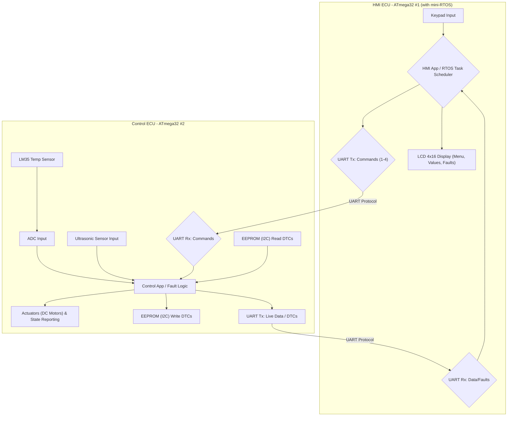

# 🚗 Vehicle Fault Detection and Logging System (VFDLS)

**Project Lead:** Mario Emad Boles
**Date:** 10/10/2025
---

## 📸 System Overview

****

The Vehicle Fault Detection and Logging System (VFDLS) is a robust embedded project designed around a **Dual-ATmega32 Electronic Control Unit (ECU)** architecture. Its primary function is the continuous, real-time monitoring of critical vehicle subsystems, fault detection, and permanent logging of Diagnostic Trouble Codes (DTCs). This setup mimics professional automotive architecture by strictly separating the system control logic from the user interface.

| Feature | Details |
| :--- | :--- |
| **Microcontrollers** | Two ATmega32 MCUs (running at 8 MHz) |
| **Communication** | UART Protocol between ECUs |
| **Fault Logging** | External EEPROM (24C16 via I2C) for permanent DTC storage |
| **User Interface** | $4\times16$ LCD Display & $4\times4$ Keypad |
| **Monitored Subsystems** | Engine Temperature (LM35), Parking Distance (Ultrasonic), Car Windows (DC Motors) |

---

## ⚙️ Project Architecture & Data Flow

The VFDLS utilizes two dedicated ECUs, communicating asynchronously to maintain system responsiveness and modularity.

### 1. HMI ECU (Human-Machine Interface) - ATmega32 #1

* **Role:** Handles all driver-facing interactions (Input/Output).
* **Key Responsibilities:**
    * Manages the Main Menu and user command input from the $4\times4$ Keypad.
    * Sends user commands (Start, Display Values, Retrieve Faults, Stop) to the Control ECU via UART.
    * Receives and displays real-time sensor data and logged fault codes on the $4\times16$ LCD.
* **Advanced Feature:** Integrates a **custom-developed mini-RTOS** to handle periodic tasks like Keypad scanning and menu state management efficiently.

### 2. Control ECU (Core System Logic) - ATmega32 #2

* **Role:** The core processing and control unit.
* **Key Responsibilities:**
    * Reads inputs from the LM35 (via ADC) and Ultrasonic Sensor (via ICU).
    * Performs fault detection against defined thresholds (e.g., Temp $>90^{\circ}C$, Distance $<10$ cm).
    * Logs new DTCs permanently to the external EEPROM via the I2C interface.
    * Manages the state of the DC Motors (Car Windows).
    * Transmits live sensor values and stored faults to the HMI ECU upon request via UART.

### System Workflow (Mermaid Diagram)

